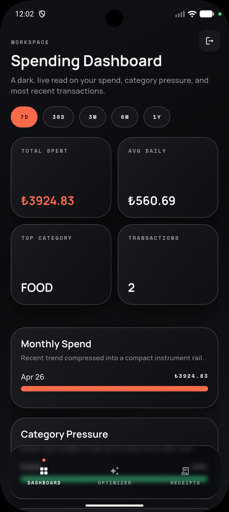
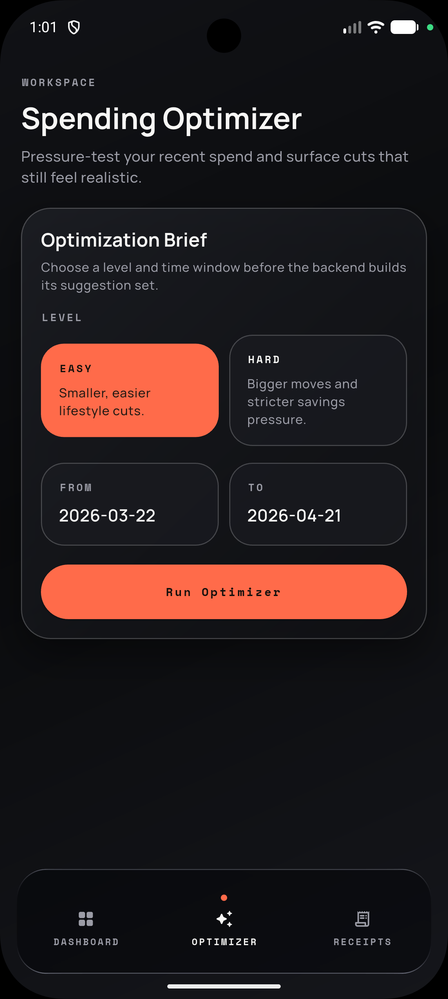
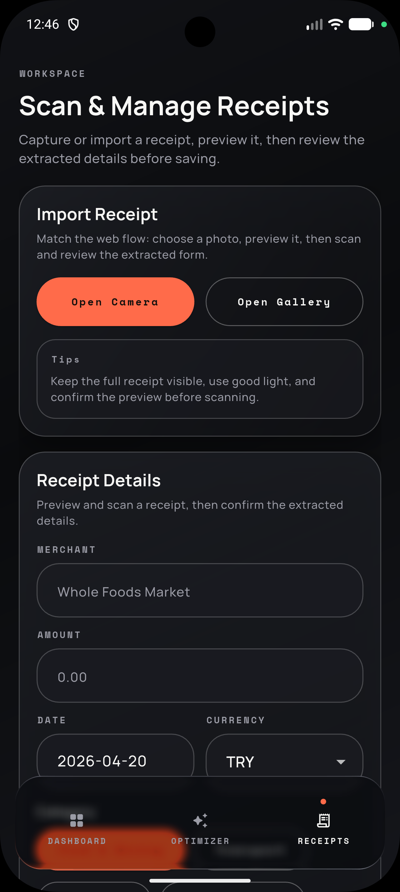
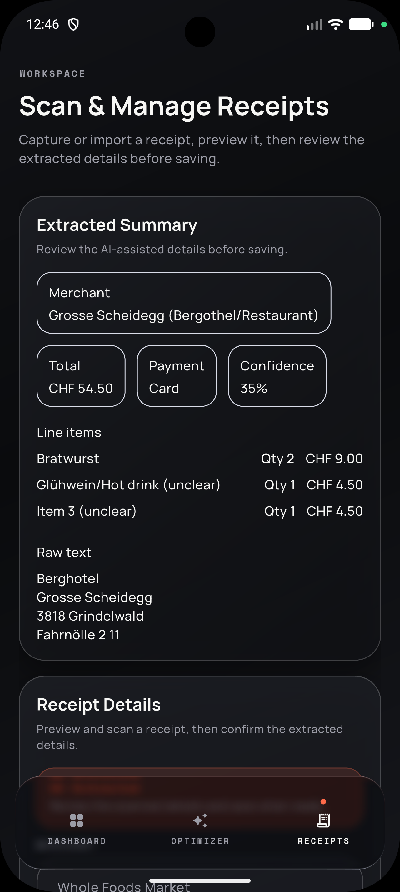

# clrk-mobile

`clrk-mobile` is the Flutter companion app for clrk. It focuses on fast receipt capture, quick dashboard check-ins, and optimizer prompts that are easy to use from a phone-sized workflow.

## Screenshots

<p>
  
  
  
  
</p>

## What It Does

- shows a compact spending dashboard with time filters, category pressure, and recent transaction summaries
- captures receipts with camera or gallery import
- previews extracted receipt details before save
- lets users review AI-generated summaries and confidence hints
- provides a mobile optimizer flow with date ranges and savings difficulty levels
- keeps the experience session-aware with protected routes and auth flows

## Tech Stack

- Flutter stable
- Dart SDK `^3.11.4`
- hooks_riverpod 3.3.1
- riverpod_annotation 4.0.2
- go_router 17.2.1
- dio 5.9.2
- dio_cookie_manager 3.3.0
- camera 0.12.0+1
- image_picker 1.2.1
- shared_preferences 2.5.3
- forui 0.21.1
- google_fonts 8.0.2
- talker 5.1.16
- flutter_native_splash 2.4.6

## App Structure

- `lib/features/auth/` contains onboarding, auth entry, login, and register flows
- `lib/features/dashboard/` contains dashboard models, repositories, and presentation
- `lib/features/receipt/` contains capture, extraction, save, delete, and list flows
- `lib/features/optimizer/` contains the optimizer brief and result UI
- `lib/shared/` contains routing, theme, reusable UI, API wiring, and helpers

## Local Development

Install packages:

```bash
flutter pub get
```

Run on a device or simulator:

```bash
flutter run
```

Useful targets:

```bash
flutter run -d ios
flutter run -d android
flutter run -d macos
flutter run -d chrome
```

The app expects the API at `https://api.clrk.app` by default. You can override it with:

```bash
flutter run --dart-define=API_BASE_URL=https://api.clrk.app
```

## Build

```bash
flutter build apk
flutter build ios
```

## Notes

The mobile app shares the same backend concepts as the web app, but its UX is optimized for faster daily use: receipt capture first, short summaries, and quick navigation between dashboard, optimizer, and receipts.
