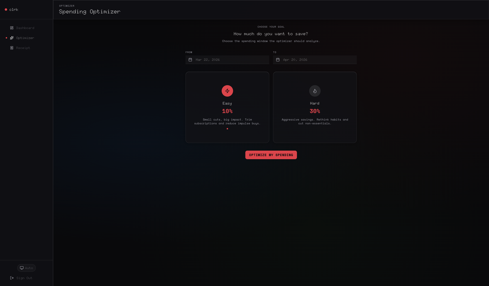
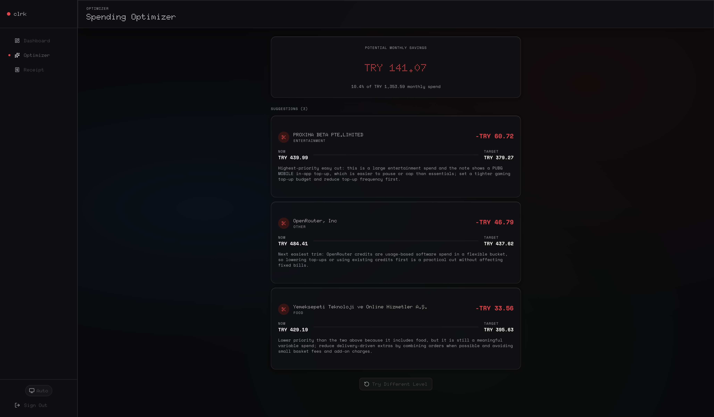
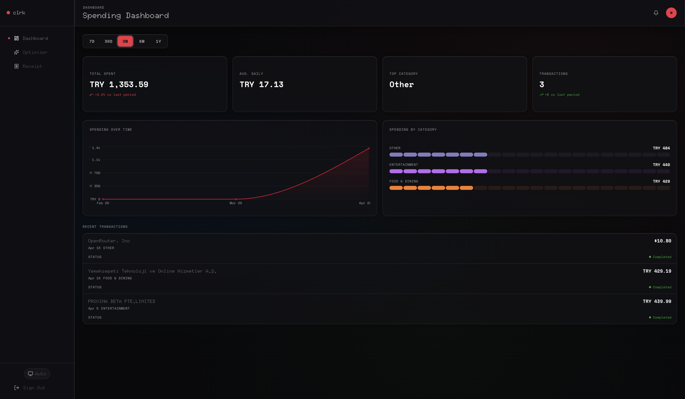

# clrk-web

`clrk-web` is the browser client for clrk. It gives users a desktop-first finance workspace with an authenticated spending dashboard, AI-assisted receipt intake, and an optimizer flow for spotting realistic savings opportunities.

Live app: [clrk.app](https://clrk.app)

## Screenshots







## What It Does

- shows spend totals, average daily spend, top category, and recent transactions
- visualizes spending over time and category pressure
- lets users upload receipts and review extracted data before saving
- provides optimizer suggestions based on a selectable spending window and savings intensity
- keeps the workspace behind Better Auth session handling and verified-email flows

## Tech Stack

- React 19.2.5
- TanStack Start 1.167.16
- TanStack Router 1.168.10
- TanStack Query 5.96.2
- TanStack Form 1.29.0
- Vite 8.0.9
- Tailwind CSS 4.2.2
- Better Auth 1.6.5
- Recharts 3.8.1
- Zustand 5.0.12
- Zod 4.3.6
- Axios 1.15.1
- Sentry for TanStack Start 10.49.0

## App Structure

- `src/routes/` holds the route tree for landing, auth, dashboard, optimizer, and receipt flows
- `src/features/dashboard/` contains dashboard data hooks, types, and UI
- `src/features/optimizer/` contains the goal selection and suggestion UI
- `src/features/receipt/` contains receipt upload, extraction review, and CRUD forms
- `src/lib/` contains shared auth and API client logic

## Local Development

Install dependencies:

```bash
pnpm install
```

Create a local env file if you do not already have one:

```bash
cp .env.example .env.local
```

Run the app:

```bash
pnpm dev
```

The dev server runs on `http://localhost:3000`.

## Production Build

```bash
pnpm build
pnpm start
```

## Test

```bash
pnpm test
```

## Docker

The production container is built from [`Dockerfile`](./Dockerfile) and is intended to sit behind the root-level Compose stack. The build takes API base URLs as build args and runs the production server on port `3000`.
